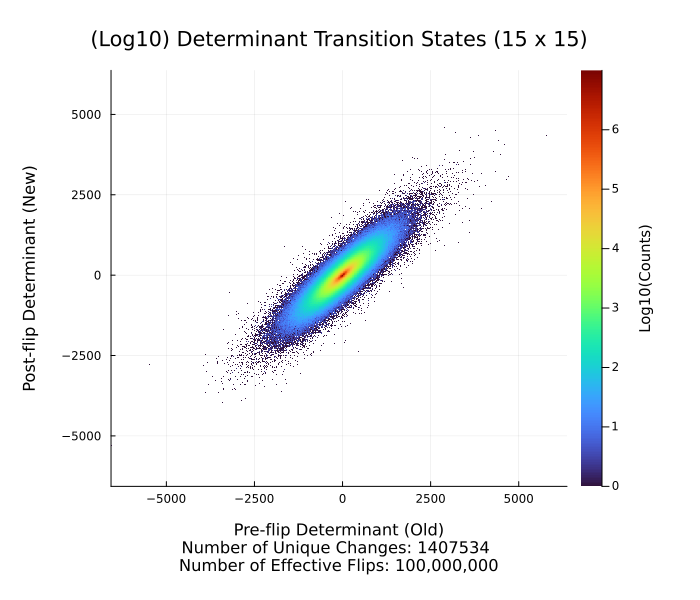

<i><b> Extra files pursuant a variety of other avenues of research. </i></b>

## Transition State Sampling

Refer to main_markov.jl for sampling and plotting code. 

Performs sampling of determinant transition states by collecting pre and post values for matrix determinant.
Plots these transitions using a heatmap based on the count / amount of times they appear in the sampling process.

Example image below:

